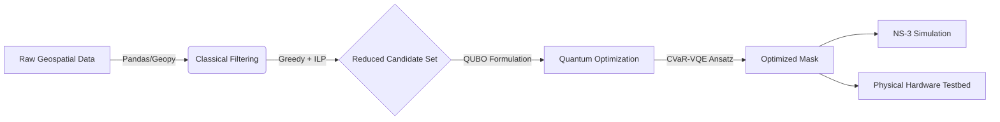

<div align="center">

  <h1>🛰️ OPTIC-5G</h1>
  <h3>Hybrid Classical-Quantum Optimization for Energy-Efficient 5G Networks</h3>

  <p>
    <b>A Thesis-Driven Research Framework for 5G/6G Topology Control</b><br>
    Validated via NS-3 Digital Twin & Physical Hardware Testbed
  </p>

  <a href="https://www.python.org/">
    
  </a>
  <a href="https://qiskit.org/">
    
  </a>
  <a href="https://www.nsnam.org/">
    
  </a>
  <a href="https://opensource.org/licenses/MIT">
    
  </a>
  <br>
</div>

---

## 📖 Overview

**OPTIC-5G** solves the "Over-Provisioning" problem in ultra-dense 5G networks. Instead of leaving all base stations "Always-On" (which wastes power and causes interference), this framework identifies the **minimal active topology** required to maintain coverage.

It uses a unique **Hybrid Pipeline**:
1.  **Classical Filtering (Greedy + ILP):** Rapidly shrinks the search space.
2.  **Quantum Optimization (CVaR-VQE):** Finds the optimal configuration using IBM's Qiskit SDK.

> **🏆 Validated Results:**
> * **90.9%** Reduction in Energy Consumption (Simulation).
> * **40.6%** Improvement in Signal Quality / SNR (Physical Testbed).
> * **13.76 dB** RMSE between Digital Twin and Reality.

---

## 🧩 System Architecture

The system follows a strict data-to-deployment pipeline.



📂 Repository Structure
Plaintext
OPTIC-5G/
├── data/                  # Raw CSVs (Tower locations, obstructions)
├── scripts/
│   ├── extract_towers.py  # PDF scraping & Geocoding
│   ├── greedy_ilp.py      # Classical Optimization (PuLP)
│   ├── quantum_opt.py     # Qiskit VQE Circuit & QUBO
│   └── analysis.py        # RMSE & SNR plotting
├── simulations/           # NS-3 C++ Scripts (manila_5g.cc)
├── hardware/              # Logs from TP-Link PharOS Routers
└── README.md              # This file

## 🔬 Methodology & Tech Stack

| Component | Technology Used | Description |
| :--- | :--- | :--- |
| **Data Ingestion** | `Pandas`, `Geopy` | Conversion of raw addresses to Cartesian (X,Y) metric space. |
| **Classical Solver** | `PuLP`, `SciPy` | Integer Linear Programming (ILP) to filter redundant nodes. |
| **Quantum Solver** | **IBM Qiskit** | CVaR-VQE Ansatz with TwoLocal circuits to minimize Hamiltonian energy. |
| **Digital Twin** | **NS-3 (C++)** | Large-scale mmWave/LTE simulation of Manila (243 Nodes). |
| **Physical Testbed** | **TP-Link PharOS** | 16-node programmable router mesh at PUP Tennis Court. |

---

## 📊 Key Findings

### 1. Simulation Results (Manila City)
*Validated via NS-3 Digital Twin (243 Candidate Nodes)*

| Metric | Baseline (All ON) | OPTIC-5G (Optimized) | Result |
| :--- | :---: | :---: | :--- |
| **Active Nodes** | 243 | **22** | 🔻 **90.9% Drop** (Infrastructure Reduction) |
| **Energy (Est)** | 31,590 W | **2,860 W** | ⚡ **Massive Savings** (Green 5G) |
| **Throughput** | 1.38 Mbps | **1.20 Mbps** | ✅ **Service Retained** (87% Capacity) |

<br>

### 2. Experimental Results (Physical Hardware)
*Validated via TP-Link PharOS Testbed (PUP Main Campus)*

| Metric | Baseline (16 Nodes) | OPTIC-5G (8 Nodes) | Result |
| :--- | :---: | :---: | :--- |
| **Mean SNR** | 17.50 dB | **24.62 dB** | 📈 **+40.6% Signal Boost** |
| **Hardware Power** | 16 Routers | **8 Routers** | 🔋 **50% Energy Cut** |
| **Model Accuracy** | -- | -- | 🎯 **13.76 dB RMSE** (Sim vs. Physical) |

---

## ⚙️ Quick Start

**1. Clone the Repo**
```bash
git clone [https://github.com/your-username/OPTIC-5G.git](https://github.com/aguillonlei-alt/OPTIC-5G.git)
cd OPTIC-5G

2. Install Python Requirements

3. Run the Hybrid Optimizer
python scripts/run_hybrid_opt.py --input data/manila_towers.csv
# Output: optimized_mask.txt (Binary String)

4. Run NS-3 Simulation (Requires C++)
./ns3 run "scratch/manila_5g --mask=$(cat optimized_mask.txt)"

👥 Contributors
Polytechnic University of the Philippines – Sta. Mesa, Manila
Bachelor of Science in Electronics Engineering (BSECE)
Jann Lei Randolf A. Aguillon
